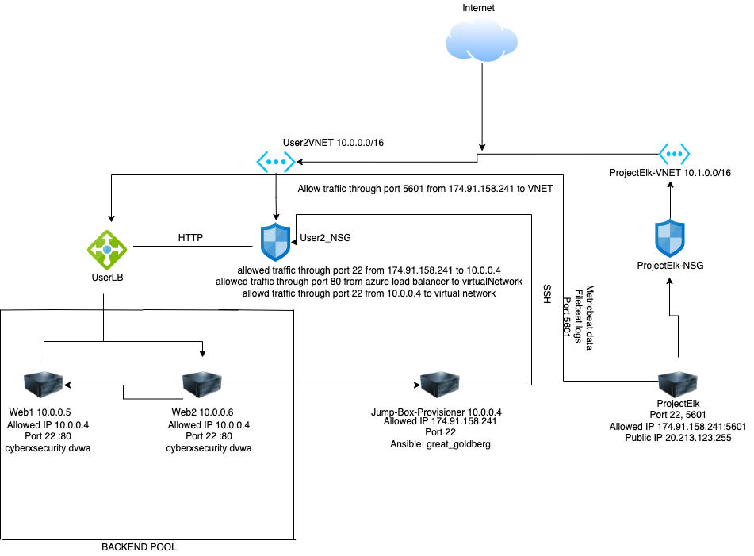

## Automated ELK Stack Deployment

The files in this repository were used to configure the network depicted below.

These files have been tested and used to generate a live ELK deployment on Azure. They can be used to either recreate the entire deployment pictured above. Alternatively, select portions of the Playbook file may be used to install only certain pieces of it, such as Filebeat.

install-elk.yml
metricbeat-playbook.yml
filebeat-playbook.yml

This document contains the following details:
- Description of the Topologu
- Access Policies
- ELK Configuration
  - Beats in Use
  - Machines Being Monitored
- How to Use the Ansible Build

### Description of the Topology

The main purpose of this network is to expose a load-balanced and monitored instance of DVWA, the D*mn Vulnerable Web Application.

Load balancing ensures that the application will be highly available, in addition to restricting traffic to the network.
- Load balancers function on stopping DDOS attacks, Jumpbox makes sure only one machine server has an admin access to the network.

Integrating an ELK server allows users to easily monitor the vulnerable VMs for changes to the logs and system traffic.
- Filebeat monitors log files and sends it to elasticsearch, Some logs filebeat collects include syslogs, ssh login attempts e.t.c
- Metricbeat collects metrics and stats and sends it to elasticsearch

The configuration details of each machine may be found below.
_Note: Use the [Markdown Table Generator](http://www.tablesgenerator.com/markdown_tables) to add/remove values from the table_.

| Name     | Function  | IP Address | Operating System |
|----------|---------- |------------|------------------|
| Jump Box | Gateway   | 10.0.0.1   | Linux            |
| WEB1     |  DVWA       10.0.0.5   | Linux            |
| WEB2     |  DVWA     | 10.0.0.6   | Linux            |
| ELK      |HostMachine| 10.1.0.4   | Linux            |

### Access Policies

The machines on the internal network are not exposed to the public Internet. 

Only the Jumpbox machine can accept connections from the Internet. Access to this machine is only allowed from the following IP addresses:
- 174.91.158.21

Machines within the network can only be accessed by Jump-Box-Provisioner
- Jump-Box-provisioner is the only machine that is allowed to access the ELK server, with its private IP: 10.0.0.4

A summary of the access policies in place can be found in the table below.

| Name     | Publicly Accessible | Allowed IP Addresses |
|----------|---------------------|----------------------|
| Jump Box | Yes/No              | 174.91.158.241       |
| Web1     | NO                  |                      |
| Web2       No
  Elk      | Yes                 | 10.0.0.4             |

### Elk Configuration

Ansible was used to automate configuration of the ELK machine. No configuration was performed manually, which is advantageous because...
- It saves time installing applications, instead with the playbook we are able to install multiple applications

The playbook implements the following tasks:
ELK 
-  installs docker.io and python3-pip
-  installs docker module
-  increases memory to 262144
-  downloads and launches the elk container
-  Enables service docker on boot

FILEBEAT
-  downloads filebeat deb
-  install filebeat deb
-  drop in filebeat config file
-  enable and configures docker module for filebeat
-  setup filebeat
-  starts filebeat
-  enables service filebeat on boot

METRICBEAT
-  download metricbeat
-  install metricbeat 
-  drop in metricbeat config
-  enable and configure docker module for metricbeat
-  setup metricbeat
-  starts metricbeat
-  enables service metricbeat on boot

The following screenshot displays the result of running `docker ps` after successfully configuring the ELK instance.

!Diagrams/ps-a.png

### Target Machines & Beats
This ELK server is configured to monitor the following machines:
- 10.0.0.5 : 10.0.0.6

We have installed the following Beats on these machines:
- 10.0.0.5 : 10.0.0.6

These Beats allow us to collect the following information from each machine:
- Filebeat monitors log files and sends it to elasticsearch, Some logs filebeat collects include syslogs, ssh login attempts e.t.c
- Metricbeat collects metrics and stats and sends it to elasticsearch

### Using the Playbook
In order to use the playbook, you will need to have an Ansible control node already configured. Assuming you have such a control node provisioned: 

SSH into the control node and follow the steps below:
- Copy the install-elk.yml, filebeat-config.yml, metricbeat-config.yml file to /etc/ansible.
- Update the config file to include hosts: 10.1.0.4:9200 and hosts: 10.1.0.4:5601
- Update ansible config file to add webservers : 10.0.0.5, 10.0.0.6, 10.1.0.4
- Run the playbook, and navigate to http://174.91.158.241:5601/ to check that the installation worked as expected.

Installing playbook, make sure you are in the ansible directory then run ansible-playbook install-elk.yml
For filebeat it would be similar command , ansible-playbook filebeat-playbook.yml
For metricbeat, run ansible-playbook metricbeat-playbook.yml
